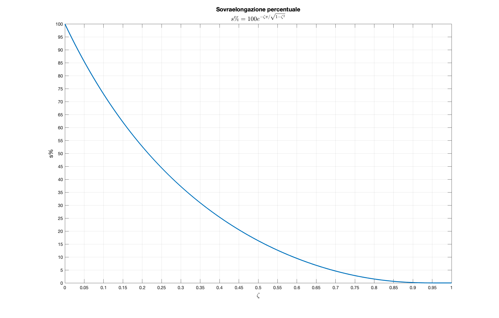

# zitaDaSovraelongazione
Ricava il valore di zita da utilizzare a partire dalla sovraelongazione percentuale desiderata.
#### Funzionamento
La routine inverte la relazione che lega la sovraelongazione percentuale al coefficiente zita, e utilizza la funzione per calcolare il valore di zita da utilizzare.
Utilizzare questa routine è equivalente a scegliere un valore sulle ascisse a partire dell'ordinata desiderata su questo grafico

#### TODO:
- aumentare la robustezza della funzione
